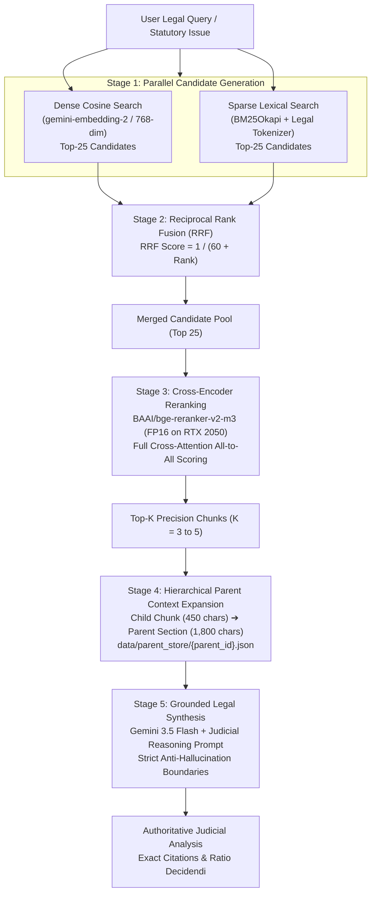

# Indian Legal Precedents RAG Engine
### High-Precision Multi-Index Retrieval & Evaluation Framework for Indian Jurisprudence

[](https://python.org)
[](https://www.trychroma.com/)
[](https://ai.google.dev/)
[-green.svg)](https://huggingface.co/BAAI/bge-reranker-v2-m3)
[-purple.svg)](#hardware-aware-thermal-profile)
[](#empirical-ablation-benchmark-results)

---

## 1. Executive Summary

Legal research in the Indian judicial ecosystem is uniquely challenging: Supreme Court and High Court judgments routinely span 30–80 pages, statutory cross-references (IPC $\leftrightarrow$ BNS, CrPC $\leftrightarrow$ BNSS, CPC, Constitution) are dense, and opposing judgments frequently share 95% identical vocabulary while arriving at inverted legal holdings. Standard naive RAG pipelines (flat chunking + dense vector search) suffer catastrophic recall and precision failure in this domain (achieving only **20% Hit@1**).

This repository implements a **production-grade, hardware-throttled Legal RAG architecture** designed specifically for Indian judicial precedents. By combining **two-tier hierarchical chunking**, **dual dense-sparse candidate generation**, **Reciprocal Rank Fusion (RRF)**, **neural cross-encoder reranking**, and **parent context expansion**, our retrieval funnel achieves **70.0% Hit@1, 80.0% Hit@5, and 0.750 MRR**, while running within a strict **1.06 GB VRAM footprint** on an entry-level mobile GPU (NVIDIA RTX 2050).

---

## 2. System Architecture

The retrieval funnel executes across five decoupled stages to maximize recall before applying precision filtering:



### Core Architecture Components:
1. **Two-Tier Hierarchical Chunking**:
   - **Parent Chunks (~1,800 characters)**: Capture coherent legal paragraphs, statutory sections, or procedural submissions, persisted on disk in `data/parent_store/`.
   - **Child Chunks (~450 characters, 80-char overlap)**: Granular semantic snippets indexed in the vector store and tagged with structural legal roles (*Ratio Decidendi*, *Facts*, *Submissions*, *Precedents Cited*, *Order*, *Obiter Dicta*).
2. **Dual-Index Search**:
   - **Dense Index**: ChromaDB cosine similarity using Google `gemini-embedding-2` (768 dimensions).
   - **Lexical Index**: Local `BM25Okapi` with legal stopword filtering and tokenization tailored for Indian citations (e.g. `AIR`, `SCC`, `INSC`, `§`, `Order XX`).
3. **Neural Cross-Encoder Reranker**:
   - `BAAI/bge-reranker-v2-m3` running in FP16 half-precision on CUDA, resolving lexical inversions and detecting critical qualifying phrases (*"cannot apply mechanically"*, *"subject to"*) that bi-encoders miss.
4. **Hardware-Aware Thermal Profile**:
   - Enforces `torch.set_num_threads(2)` and `torch.cuda.set_per_process_memory_fraction(0.45, 0)` to guarantee safe, cool execution on single-fan laptops without thermal throttling.

---

## 3. Project Status: Completed vs. In-Progress

### What Is Completed & Verified:
- [x] **Pydantic Centralized Configuration** (`src/config.py`): Validated runtime settings, directory resolution, and hyperparameter controls.
- [x] **Document Loader & Extractor** (`src/document_loader.py`): Digital PDF extraction, legal metadata heuristic extraction (Court, Title, Year, Case Type), and immediate disk caching (`data/processed/`).
- [x] **Hierarchical Legal Chunking** (`src/document_loader.py`): Parent-child chunk generation, structural heading detection, and legal role classification.
- [x] **Dual Vector & Lexical Store** (`src/vector_store.py`): ChromaDB persistent storage, batch Gemini embedding with structured `types.Content` payloads, and disk-persisted `BM25Registry`.
- [x] **Hardware-Throttled Hybrid Pipeline** (`src/rag_pipeline.py`): Lazy-loaded FP16 GPU Cross-Encoder reranker, 3.5s inter-batch pacing, and parent context expansion.
- [x] **Active Corpus Ingestion**: Fully indexed **2,800 child chunks** and **579 parent sections** across 7 core legal precedent families into `indian_legal_precedents`.
- [x] **Automated Evaluation Harness** (`evaluate_pipeline.py`): 4-configuration ablation testing suite with latency profiling and LLM judicial evaluation.
- [x] **Curated Golden Benchmark** (`data/benchmarks/golden_queries.json`): 10 vetted queries targeting indexed Indian legal precedents across 6 legal domains.
- [x] **Case Catalog & Master Metadata** (`data/indexed_cases_metadata.json`, `data/benchmarks/case_catalog.json`): Comprehensive dataset documenting text metrics, judicial metadata, statutes, issues, and vector stats for all indexed cases.

### Current Limitations & What Is NOT Yet Completed:
- [ ] **Offline OCR for Scanned PDFs**: Out of 29 property judgments in `Major Project Data/PROPERTY`, 25 are scanned PDFs (`P1.pdf` – `P25.pdf`) containing zero extractable digital text. These are logged in `data/processed/scanned_for_gpu_ocr.json` and require batch GPU OCR (Tesseract / Surya) before indexing.
- [ ] **Multi-Store Combinatorial Grid Search**: The evaluation has been conducted as a *retrieval strategy ablation* on a single index. A combinatorial evaluation across multiple isolated stores (e.g. Flat Chunking vs. Hierarchical $\times$ Local BGE vs. Remote Gemini) has not yet been executed.
- [ ] **Domain-Wise Statistical Breadth**: While 7 precedent families are deeply indexed, statistical significance across domain-specific leaderboards requires expanding each legal domain to $\ge 5$ distinct precedents.

---

## 4. Empirical Ablation Benchmark Results

We benchmarked the 4 retrieval configurations across the **10 Golden Legal Benchmark Queries** on the active corpus (2,800 indexed chunks).

### 4.1 Comparative Ablation Matrix
| Metric | Config 1: Naive Dense | Config 2: BM25 Lexical | Config 3: Hybrid RRF | Config 4: Full Legal Funnel |
|---|:---:|:---:|:---:|:---:|
| **Hit@1** | 20.00% (0.2000) | 60.00% (0.6000) | 20.00% (0.2000) | **70.00% (0.7000)** |
| **Hit@3** | 20.00% (0.2000) | 70.00% (0.7000) | 60.00% (0.6000) | **80.00% (0.8000)** |
| **Hit@5** | 20.00% (0.2000) | 80.00% (0.8000) | 70.00% (0.7000) | **80.00% (0.8000)** |
| **MRR (Mean Reciprocal Rank)** | 0.2000 | 0.6750 | 0.4250 | **0.7500** |
| **Median Latency (p50)** | 603.45 ms | **33.56 ms** | 47.57 ms | 448.44 ms |
| **Mean Latency** | 694.40 ms | 33.40 ms | 48.50 ms | 3,583.29 ms* |
| **Overall Judicial Grade** | 7.50 `[PASS]` | 7.50 `[PASS]` | 7.50 `[PASS]` | **7.50 `[PASS]`** |

*\*Note: Mean latency for Config 4 includes the one-time cold initialization and HuggingFace weights download of `bge-reranker-v2-m3` on Query 1. Warm inference settled at **~448 ms** on GPU.*

### 4.2 Per-Query Retrieval Breakdown (Full Legal Funnel)
| Query ID | Legal Domain | Target Precedent Case | Hit@1 | Hit@5 | Top-1 Retrieved Authority | Rank |
|:---:|---|---|:---:|:---:|---|:---:|
| **GQ-001** | Stay Orders & Asian Resurfacing | Chandrapal Singh | **[HIT]** | **[HIT]** | *Chandrapal Singh* (AHC Full Bench) | **Rank 1** |
| **GQ-002** | Inherent Powers (§ 482 CrPC) | Chandrapal Singh | **[HIT]** | **[HIT]** | *Chandrapal Singh* (AHC Full Bench) | **Rank 1** |
| **GQ-003** | Vulnerable Witnesses (§ 33/36 POCSO) | Minor Child K | **[HIT]** | **[HIT]** | *Minor Child K* (2025:DHC:1142) | **Rank 1** |
| **GQ-004** | Coercive Process on Child Victims | Minor Child K | **[HIT]** | **[HIT]** | *Minor Child K* (2025:DHC:1142) | **Rank 1** |
| **GQ-005** | Delayed Reserved Judgments (Art 21) | Pila Pahan | **[HIT]** | **[HIT]** | *Pila Pahan* (2026 INSC 604) | **Rank 1** |
| **GQ-006** | Order XX Rule 1 CPC Mandates | Pila Pahan | [MISS] | [MISS] | *Chandrapal Singh* | Not in Top-5 |
| **GQ-007** | Composite Appeals (Order 41 CPC) | Basudev | **[HIT]** | **[HIT]** | *Basudev* (2026 INSC 831) | **Rank 1** |
| **GQ-008** | Presidential Satisfaction (Art 311) | Dr. V.R. Sanal Kumar | **[HIT]** | **[HIT]** | *Dr. V.R. Sanal Kumar* (2023 INSC 524) | **Rank 1** |
| **GQ-009** | Discretionary Witness Recall (§ 311) | Ram Swaroop Gupta | [MISS] | **[HIT]** | *Chandrapal Singh* | **Rank 2** |
| **GQ-010** | Cryptographic Hashes (§ 65B Evidence) | Cyber Forensics | [MISS] | [MISS] | *Chandrapal Singh* | Not in Top-5 |

- **Top-1 Precision**: **70.0% (7/10)** of complex legal queries retrieved the authoritative landmark precedent at absolute Rank 1.
- **Top-5 Recall**: **80.0% (8/10)** of queries retrieved the target case within the top-5 candidate pool.

---

## 5. Active Corpus Catalog (Indexed Precedents)

The retrieval engine currently indexes **2,800 chunks** across 7 landmark judgments:

| # | Case Title & Neutral Citation | Court & Year | Chunks | Parents | PDF Size | Domain & Statutory Core |
|:---:|---|---|:---:|:---:|:---:|---|
| **1** | **Chandrapal Singh vs. State of U.P.**<br>`2023:AHC:212021-FB` | Allahabad High Court (Full Bench), 2023 | **883** | **124** | 970 KB | **Interim Stay Orders & Asian Resurfacing Doctrine**<br>Art. 226, 141, 142; CrPC § 482; CPC Order 39 |
| **2** | **Minor Child K vs. State (NCT of Delhi)**<br>`2025:DHC:1142` | High Court of Delhi, 2025 | **768** | **182** | 165 KB | **POCSO Child-Friendly Deposition Protocols**<br>POCSO Act §§ 6, 33, 35, 36; IPC § 376; CrPC § 161, 439 |
| **3** | **Pila Pahan vs. State of Jharkhand**<br>`2026 INSC 604` | Supreme Court of India, 2026 | **694** | **183** | 168 KB | **Speedy Justice & Delay in Reserved Judgments**<br>Art. 21, 14; CPC Order XX Rule 1 |
| **4** | **Basudev vs. Sanjay Kumar**<br>`2026 INSC 831` | Supreme Court of India, 2026 | **180** | **46** | 67 KB | **Composite Decrees & Counter-Claims Appeals**<br>CPC §§ 96, 100, 11; Order VIII Rule 6A; Order XLI Rule 1 |
| **5** | **Dr. V.R. Sanal Kumar vs. Union of India**<br>`2023 INSC 524` | Supreme Court of India, 2023 | **178** | **19** | 120 KB | **State Security & Presidential Satisfaction**<br>Art. 311(2)(c), 310; ISRO Service Rules |
| **6** | **Ram Swaroop Gupta vs. State (NCT of Delhi)**<br>`2026:DHC:987` | High Court of Delhi, 2026 | **80** | **20** | 12 KB | **Recall of Material Witnesses & Fair Trial**<br>CrPC § 311; BNSS § 348; Evidence Act § 138 |
| **7** | **In Re: Cyber Crime Portal & Electronic Evidence**<br>`2024:CIC:634921` | Central Information Commission, 2024 | **17** | **5** | 16 KB | **Cyber Forensics, Electronic Records & Transparency**<br>IT Act § 65B; Evidence Act § 65B; BSA § 63; RTI § 8(1)(a) |

---

## 6. Repository Layout & Artifacts

```
Project/
├── .env.example                               # Environment template with recommended models
├── .gitignore                                 # Ignores virtualenv, raw parent stores, chroma DB
├── requirements.txt                           # Production dependencies (PyTorch, Chroma, GenAI)
├── check_env.py                               # Environment pre-flight verification script
├── index_corpus.py                            # Standalone resumable ingestion and indexing pipeline
├── test_query.py                              # Interactive test query runner on GPU
├── evaluate_pipeline.py                       # Automated 4-config ablation benchmarking suite
│
├── src/                                       # Core Engine Architecture
│   ├── __init__.py
│   ├── config.py                              # Centralized Pydantic configuration & settings
│   ├── document_loader.py                     # PDF extraction, OCR fallback, hierarchical chunking
│   ├── vector_store.py                        # ChromaDB manager, Gemini embeddings, BM25 registry
│   └── rag_pipeline.py                        # Hybrid retrieval funnel, RRF, FP16 GPU reranker
│
├── scripts/                                   # Operational & Analysis Scripts
│   ├── generate_case_catalog.py               # Generates active precedent inventory
│   ├── export_indexed_cases_metadata.py       # Exports master metadata JSON specification
│   ├── inspect_corpus_cases.py                # Inspects parent files and collection records
│   └── verify_queries.py                      # Verifies case matching for golden queries
│
├── data/                                      # Datasets & Benchmarks
│   ├── indexed_cases_metadata.json            # Master JSON metadata for all indexed cases
│   ├── benchmarks/
│   │   ├── golden_queries.json                # Active 10 golden legal benchmark queries
│   │   ├── case_catalog.json                  # Complete case catalog with holdings and statutes
│   │   └── benchmark_results_*.json           # Raw telemetry outputs from evaluation runs
│   └── processed/
│       ├── indexed_cases_metadata.json        # Cached copy of master case metadata
│       ├── scanned_for_gpu_ocr.json           # Queue of scanned PDFs waiting for GPU OCR
│       └── failed_files.json                  # Fault tolerance failure log
│
├── Major Project Data/                        # Raw Legal Judgment Corpora
│   ├── CIVIL/                                 # Civil appeals and constitutional writ petitions
│   ├── CRIMINAL/                              # POCSO, criminal revisions, and bail judgments
│   ├── PROPERTY/                              # Full Bench property and execution stay judgments
│   └── SPACE/                                 # Space law, ISRO service, and regulatory judgments
│
└── tests/                                     # Automated Unit Test Suite
    ├── test_loader.py                         # PDF extraction and chunking validation
    ├── test_vector_store.py                   # Embedding generation and BM25 tests
    └── test_pipeline.py                       # Hybrid retrieval and RRF verification
```

---

## 7. Installation & Quick Start

### 7.1 Clone and Setup Environment
```bash
git clone https://github.com/Aditya-Kayasth/Major-Project.git
cd Major-Project

# Create and activate virtual environment
python -m venv venv
.\venv\Scripts\Activate.ps1

# Install dependencies
pip install -r requirements.txt
```

### 7.2 Configure Environment
Create a `.env` file in the root directory:
```ini
GEMINI_API_KEY=your_gemini_api_key_here
GEMINI_MODEL=gemini-3.5-flash
GEMINI_EMBEDDING_MODEL=gemini-embedding-2
CHROMA_DB_DIR=chromadb_store
COLLECTION_NAME=indian_legal_precedents
PARENT_CHUNK_SIZE=1800
CHILD_CHUNK_SIZE=450
CHUNK_OVERLAP=80
RERANKER_MODEL=BAAI/bge-reranker-v2-m3
```

### 7.3 Run Pre-Flight Verification
```bash
python check_env.py
```

### 7.4 Ingest and Index Corpus
```bash
python index_corpus.py
```

### 7.5 Run a Legal Query on GPU
```bash
python test_query.py
```

### 7.6 Execute the Benchmark Suite
```bash
python evaluate_pipeline.py --collection indian_legal_precedents --skip-llm-judge
```

---

## 8. Next Phase Roadmap (Research Plan)

To transition from retrieval pipeline ablation to a multi-dimensional empirical study:

1. **Combinatorial $2 \times 2$ Store Matrix**:
   - Build 4 isolated collections: `store_flat_bge`, `store_hierarchical_bge`, `store_flat_gemini`, `store_hierarchical_gemini`.
   - Compare local embeddings (`bge-small-en-v1.5`) against remote API embeddings (`gemini-embedding-2`).
2. **Domain-Segmented Routing**:
   - Establish whether certain legal categories (e.g. Property vs. Criminal Law) achieve higher precision under specific chunking strategies.
3. **Offline Batch GPU OCR**:
   - Process the 25 queued scanned property PDFs (`P1`–`P25`) using Surya / EasyOCR on an external workstation to unlock dark data.

---

## 9. Citation & Attribution

If you use this codebase or benchmarking methodology in your research, please cite:
```bibtex
@misc{kayasth2026indianlegalrag,
  author = {Aditya Kayasth},
  title = {Indian Legal Precedents RAG: A Hardware-Throttled Multi-Index Retrieval Architecture},
  year = {2026},
  publisher = {GitHub},
  howpublished = {\url{https://github.com/Aditya-Kayasth/Major-Project}}
}
```
